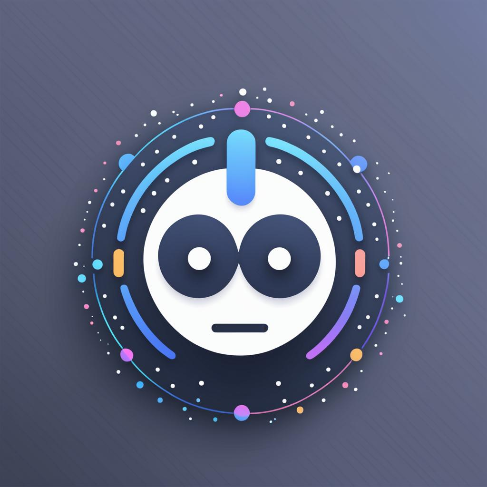

# Musebot

Musebot is a bot for Discord that bridges multiple generative AI systems into
Discord.

## Development

1. Copy .env.example to .env and fill out the configuration as it pertains to
   you development needs.
2. `npm install`
3. `npm start`

A debugging configuration is provided for Visual Studio Code.

Additional documentation is available in the
[end-user documentation](docs/Musebot.md).

## End-user Documentation

[End-user Documentation](docs/Musebot.md)
