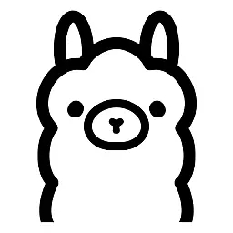

# Ollama



Ollama is an easy-to-use solution for downloading and running popular large
language models and can be downloaded from
[https://ollama.com](https://ollama.com).

## Ollama Server

There are multiple ways to run Ollama using the `ollama serve` command,
including through Docker, a systemd service, or other means. Please refer to the
[Ollama documentation](https://github.com/ollama/ollama/blob/main/README.md) to
download, configure, and install Ollama.

Once Ollama is running as a server, it's typically accessible on port `11434`
of your assigned host. If you're running Ollama on your current device, you can
most likely use `http://localhost:11434/` as a host in the `ollama.hosts` array
in your `config.jsonc` file, though make sure you specify the correct host and
port if that's not the case.

```jsonc
{
  "bots": [
    {
      // ...
      "ollama": {
        "hosts": ["http://localhost:11434/"]
      }
    }
  ]
}
```

Make sure to substitute your machine's hostname or IP address instead and that
it's accessible from your Musebot instance(s).

## Models

You can browse models for Ollama at
[https://ollama.com/search](https://ollama.com/search). If you're not certain
which model is best for your use case, we recommend trying out `gemma4:12b`. It
should perform well on most hardware and is flexible enough to answer most
questions and adopt most personas. If `gemma4:12b` is still too slow for your
hardware, consider a smaller quantization or a lighter model. You can, of
course, use any large language model that you prefer.

Ollama provides a CLI for downloading these models:

```bash
ollama pull gemma4:12b
```

Once Ollama downloads your preferred model, you can specify it in your
`config.jsonc` file by adding it to the `ollama.models` array.

## Vision

Musebot automatically detects whether a configured model supports vision
(multimodal image input) by querying Ollama's `/api/show` endpoint at startup.
If any configured model reports `vision` in its capabilities, the **Vision**
feature is enabled.

When Vision is enabled:

* **Image attachments** on user messages are fetched, encoded, and passed
  alongside the message text to the vision-capable model during the normal chat
  response. The model can "see" and reason about images users post.
* **Long-term memory** stores image interpretations: when a message with image
  attachments is stored as a memory, Musebot uses the vision model to generate a
  text description of each image, which is stored alongside the message. This
  allows the bot to recall the content of past images even though the embedding
  is text-based.
* **Image-only messages** are eligible for long-term memory storage. Without
  Vision, messages with no text body are skipped.

No configuration is required — Vision is purely auto-detected based on the
models you configure. To use it, simply pull a vision-capable model (such as
`llava` or `gemma4:12b`) and list it in `ollama.models`.

## Web Link Reading

When a user posts a message containing URLs, Musebot extracts the link
content and uses it as context for the response. This works for any model — no
vision capability is required.

* **Before replying**, Musebot fetches each URL, extracts the readable content
  using [Readability](https://github.com/mozilla/readability), and injects it
  as a system message into the LLM context. The bot can then answer questions
  about or reference the linked page.
* **In long-term memory**, link content is stored as a `web` attachment on the
  message. The extracted text is embedded alongside the message text so past
  link content is searchable.

URL detection is automatic — any `http://` or `https://` URL in the message
text is fetched. Non-HTML responses (images, PDFs, etc.) are skipped silently.
There is no configured size limit on extracted content.

## Image Attachment Support

If you also integrate Musebot with a [ComfyUI](../media/01-swarm-ui.md) instance
with `mode` set to `"chat"`, Musebot will use the large language model response
as a prompt for an image and attach it to its response asynchronously, providing
a visual for the response.

## Context Compression

As a conversation grows, the accumulated message history consumes more of the
model's context window. When the token count exceeds a configurable threshold,
Musebot automatically compresses the conversation context by summarizing older
messages into a compact summary using the same LLM. This keeps long-running
conversations responsive without losing the thread of discussion.

### How It Works

1. **Threshold check** — After each response, Musebot tokenizes the conversation
   context and compares it against the configured context window multiplied by
   the compression threshold. If the token count is below the threshold, nothing
   happens.
2. **Chunked summarization** — When the conversation exceeds the context window,
   Musebot splits the conversation into window-sized chunks, summarizes each
   chunk individually, then combines all chunk summaries (plus any existing
   summary) into a final summary. If the combined summaries still exceed the
   window, the oldest chunk summaries are dropped to fit.
3. **Replacement** — The conversation messages are replaced with the single
   summary message. The system prompt and channel topic are preserved.

### Manual Compression

Use the 🗜️ **Compress Context** button (next to the 🆑 Clear Context button)
to manually compress the conversation at any time. A confirmation prompt shows
the message count before proceeding.

### Configuration

Both settings are optional and live under `ollama` in `config.jsonc`:

```jsonc
"ollama": {
  // ...
  // The maximum context window (in tokens) for the LLM.
  // When unset, Musebot queries Ollama for the model's max context length.
  // "contextWindow": 4096,

  // The threshold (as a fraction of the context window) at which compression
  // triggers. For example, 0.75 means compression at 75% of the window.
  // "contextCompressionThreshold": 0.75
}
```

When `contextWindow` is unset, Musebot queries Ollama's `/api/show` endpoint
for the model's `context_length`. If that fails, it falls back to 4096.
