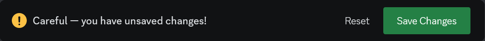
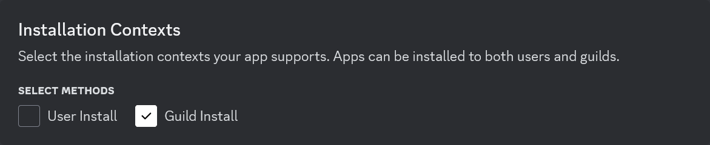
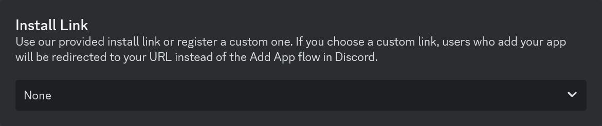
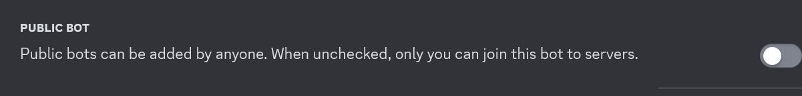
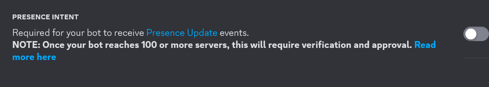
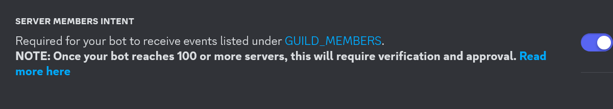
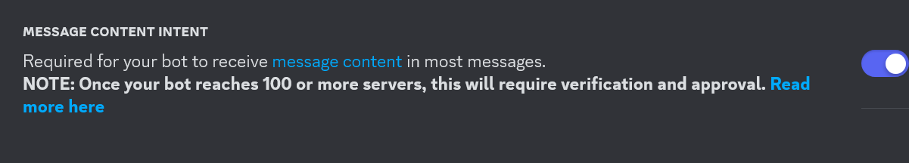
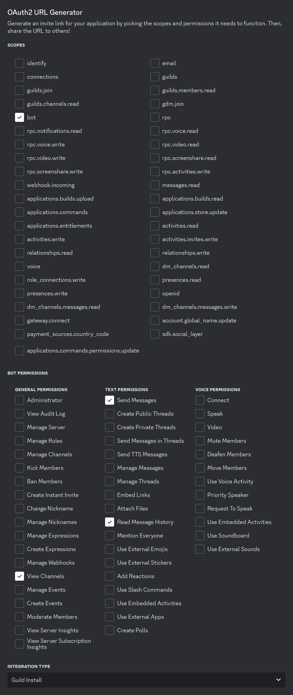

# Discord

## Bot Registration

Before starting Musebot, ensure that you've registered an application with
Discord. This guide will walk you through each required menu and setting.

### 1. Register a New Application

1. Using your web browser, navigate to the
   [Discord Developer Portal](https://discord.com/developers/applications).
2. Login to the Discord account associated with the Discord server you want to
   add Musebot to. You must be a server owner or otherwise have permissions to
   install apps.
3. Click `New Application` in the upper right hand corner and name your
   application. It does not need to be "Musebot", but can be any character or
   concept you desire. Agree to Discord's terms by checking the box.

   

### 2. General Information

1. You should already be under the `General Information` menu item, but if not,
   click the `General Information` menu item/link.

   
2. Name your application, add a profile image, and save your changes. Provide a
   description, tags, or other information if you want.
3. Save your changes.

   

### 3. Installation

1. Click the `Installation` link in the left navigation menu.

   
2. Under `Installation Contexts`, make sure `User Install` is _not_ checked and
   `Guild Install` _is_ checked.

   
3. Make sure `Install Link` is set to `None`.

   
4. Save your changes.

   

### 4. Bot

1. Click the `Bot` link in the left navigation menu.

   
2. Under the `Bot`, heading you can optionally set an icon and banner that will
   be displayed under your bot's Discord profile.
3. You can also explicitly set your bot's username if you wish to do so under
   `Username`.
4. In order to obtain your bot's authentication token, you must click the
   `Reset Token` button. Copy the value and save it under
   `MUSEBOT_DISCORD_TOKEN` in your `.env` file.

   
5. It is recommended that unless you know what you're doing, disable the toggle
   titled `Public Bot`.

   
6. The `Presence Intent` toggle can be or remain disabled.

   
7. Enable the `Server Members Intent` toggle.

   
8. Enable the `Message Content Intent` toggle.

   
9. Save your changes.

   

### 5. OAuth2

1. Click the `OAuth2` link in the left navigation menu.

   
2. Under the `OAuth2 URL Generator` in the `Scopes` checklist, check `bot`.
3. In the `Bot Permissions` checklist, check the following checkboxes:

    * View Channels
    * Send Messages
    * Read Message History

   `Integration Type` should be set to `Guild Install`.

   
4. Copy the generated link at the bottom of the page and paste it into a new
    browser tab. You will be asked to login and/or confirm the bot and its
    requested permissions.

## Lookup Discord Channel IDs

If you decide to restrict Musebot to a single or subset of channels, you'll need
to lookup you the channel IDs for your server. Follow these steps to look your
channel IDs up:

1. In Discord, go to `User Settings` » `Advanced` » `Enable Developer Mode`.
2. Right click on a channel for Musebot to use and click `Copy Channel ID`.
3. Add the channel ID(s) to the `MUSEBOT_DISCORD_CHANNELS` environment variable
   in Musebot's `.env` configuration file.

Additionally, Musebot can work across multiple Discord servers as long as the
bot is added to the server by an administrator or owner. Channel IDs are unique
to each server across all of Discord.
