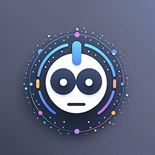

# Introduction

## What is Musebot?



Musebot is a powerful, self-hosted Discord bot that acts as a bridge to
generative AI systems. It transforms your Discord server into an interactive
platform for two distinct modes of creativity:

* **Chat Function** leverages local large language models (via Ollama) for
  context-aware conversations
* **Media Function** connects to SwarmUI or ComfyUI to generate images, video,
  music, and other media from text or image prompts.

With its flexible architecture, extensible workflow system, and seamless Discord
integration, Musebot empowers you to bring cutting-edge AI capabilities into
your community - without relying on external APIs or cloud services.

## Download Musebot

Musebot can be purchased affordably for download from the official
[XCJS Discord](https://discord.com/channels/198965819978416128/shop).

## Quick Setup

This guide will help you get Musebot up and running with its two core
integrations: **Ollama** for chat and/or **SwarmUI/ComfyUI** for media
generation.

---

### **Step 1: Prerequisites**

Before installing Musebot, ensure you have one of the following AI backends
running:

* **For Chat Functionality:** Install and run [Ollama](https://ollama.com/).
  Download a model, for example:

    ```bash
    ollama pull mistral-nemo
    ```

    Your Ollama instance should be running on `http://localhost:11434/` (or a
    known IP address).
* **For Media Functionality:** Install and run
  [SwarmUI](https://github.com/mcmonkeyprojects/SwarmUI).
  * Ensure the ComfyUI backend is accessible at
    `http://localhost:7801/ComfyBackendDirect`.
  * (Optional but helpful) Install Musebot's recommended custom nodes (detailed
    in the [full SwarmUI integration guide](integrations/swarm-ui.md)).
* **For Both:** Musebot can offer multimodal functionality if both the above
  solutions are available and configured. You will still select media or chat
  functionality.

---

### **Step 2: Download & Install**

1. Download the
   [latest Musebot release](https://discord.com/channels/198965819978416128/1342750267749302362).
2. Extract the files into a new, empty directory.
3. Copy `.env.example` to `.env`.

---

### **Step 3: Configure `.env`**

Edit your new `.env` file and set the following **required** variables:

#### 1. Bot Function

```properties
MUSEBOT_FUNCTION=chat
```

or

```properties
MUSEBOT_FUNCTION=media
```

#### 2. Discord Setup

* Register your bot in the
  [Discord Developer Portal](https://discord.com/developers/applications).
* Copy your bot's token and set:

    ```properties
    MUSEBOT_DISCORD_TOKEN=your_bot_token_here
    ```

#### 3. Configure Your Integration

* **For `MUSEBOT_FUNCTION=chat`:**

    ```properties
    MUSEBOT_OLLAMA_HOSTS=http://localhost:11434/
    MUSEBOT_OLLAMA_MODELS=mistral-nemo
    ```

* **For `MUSEBOT_FUNCTION=media`:**

    ```properties
    MUSEBOT_STABLE_DIFFUSION_HOSTS=http://localhost:7801/ComfyBackendDirect
    ```

---

#### 4. Run

##### Linux

```bash
chmod +x musebot-linux-x86_64
./musebot-linux-x86_64
```

##### Windows

* Double-click `musebot-win-x86_64.exe` or run it from PowerShell or the
  Command Prompt.

##### Docker

* See the full documentation for the `docker-compose.yml` example.

---

Your bot should now be online in your Discord server.
